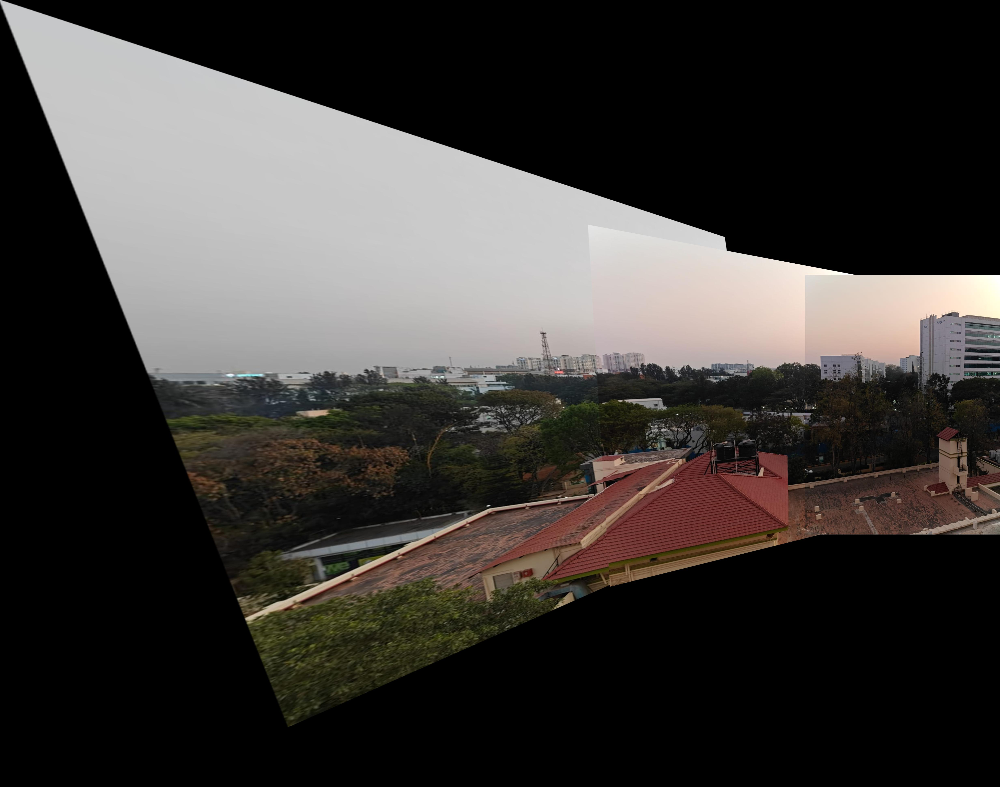

# Coin Detection & Image Stitching

## Overview
This assignment implements visual recognition techniques to detect, segment, and count Indian coins in an image. Additionally, it performs image stitching to create a panorama from multiple overlapping images.
All the execution has been implemented in python.

## Requirements
- Python 3.x
- OpenCV
- NumPy
- Matplotlib

## How to Run
1. Install dependencies:
   ```bash
   pip3 install opencv-python numpy matplotlib
   ```
2. Run the coin detection script:
   ```bash
   python3 coins.py
   ```
3. Run the image stitching script:
   ```bash
   python3 stitching.py
   ```
## Files

### images folder
- **coins folder**:  
  - `coins1.jpeg` - Overlapping coins image  
  - `coins2.jpeg` - Non-overlapping coins image  

- **stitching folder**:  
  - **clicked folder**: Contains vertical and horizontal overlapping images clicked by us.  
  - **clicked2 folder**: Contains horizontal overlapping images clicked by us.  
  - **online folder**: Contains images taken from online to check for stitching images.  

### output folder
- **coins folder**:
  - **coins1 and coins2** contain:
    - `OriginalImage_FrequencyDistribution.png` - Shows original image and frequency distribution of pixels in grayscale.  
    - `EdgeDetection.png` - Shows images of coin edges created by different methods.  
    - `CountCoinsEdgeDetection.png` - Shows images of coins with the number of coins found using the contour approach.  
    - `Segmentation.png` - Shows images of coin segmentation using various methods.  
    - `SegmentedCoins.png` - Shows segmented coins in different figures.  

- **stitching folder**:
  - `stitched_output_clicked.jpg` - Panorama image from clicked dataset.  
  - `stitched_output_clicked2.jpg` - Panorama image from clicked2 dataset.  
  - `stitched_output_online.jpg` - Panorama image from online dataset.  

### Scripts
- `stitched.py` - Python code to generate and save a panorama image.  
- `coins.py` - Python code to detect edges, segment coins, count the number of coins, and save results.  

### Documentation
- `VR Assignment 1.pdf` - Contains a description of the problem.  


## Part 1: Coin Detection & Segmentation
### Objective
- Detect, segment, and count coins from an image containing scattered Indian coins.

### Input Data
- An image containing in images folder inside coins folder.
  <div style="display: flex; justify-content: center; gap: 20px;">
    <div style="text-align: center;">
        
        <p>Overlapping coins</p>
    </div>
    <div style="text-align: center;">
        
        <p>Non-overlapping coins</p>
    </div>
</div>


### Steps
We applied edge detection techniques to identify coins in the image.  
**Approaches Tried:**
- Canny
- Sobel (X, Y, Magnitude)
- Laplacian
- Thresholding

#### **Observation:**
Canny edge detection performed better than other approaches. This is because:
- It applies Gaussian smoothing, reducing noise.
- It uses double-thresholding to detect strong and weak edges.
- The hysteresis process helps remove false edges.

#### **Edge Detection Visualization**
We visualize the detected coins by outlining their edges. The detected edges are shown in **white**, while the background remains **black**.

<div style="text-align: center;">
    
    <p>Edge Detection</p>
</div>

### Segmentation of Each Coin

#### Overview
- Use region-based segmentation to isolate individual coins.
- Output segmented images for each detected coin.

#### Approaches Tried:
1. **Contour Detection**: Uses thresholding and contour detection.
2. **Region Growing**: Expands the region based on intensity similarity.

#### Observation:
- **Region growing and Contour performs good** because:
  - It segments coins more accurately.
  - It avoids false positives due to noise or merged contours.
  - 
#### Segmentation Visualization:
<div style="text-align: center;">
    
    <p>Segmentation Image</p>
</div>

### Count the Total Number of Coins

#### Overview
- Implemented code to count the total number of detected coins.
- Displayed the final count as output.

#### Observations:
- **Overlapping coins could not be distinguished**, which affected the accuracy of the count.
- **Canny edge detection, contour detection, and region growing** performed well but struggled with overlapping coins.
- This issue is evident in the images below:
<div style="text-align: center; margin-bottom: 10px;">
    <h2>Edge Detection and Segmentation issue</h2>
</div>

<div style="display: flex; justify-content: center; gap: 20px;">
    <div style="text-align: center;">
        
        <p>Canny Edge Detection</p>
    </div>
    <div style="text-align: center;">
        
        <p>Region-Based Segmentation</p>
    </div>
</div>

- Additionally, an image displaying all segmented coins obtained through segmentation is shown below.

#### Segmentation of Coins:
<div style="text-align: center; margin-bottom: 10px;">
    <h2>Segmented Coins Comparison</h2>
</div>

<div style="display: flex; justify-content: center; gap: 20px;">
    <div style="text-align: center;">
        
        <p>Segmented Overlapping Coins</p>
    </div>
    <div style="text-align: center;">
        
        <p>Segmented Non-overlapping Coins</p>
    </div>
</div>


## Part 2: Image Stitching using Feature Matching

### Overview
This part implements **image stitching** using **feature-based methods**. We leverage **SIFT (Scale-Invariant Feature Transform)** and **FLANN (Fast Library for Approximate Nearest Neighbors)** to match keypoints between images and use **homography transformation** to align and merge them into a panorama.

We referred to a <a href="https://www.youtube.com/playlist?list=PL2zRqk16wsdp8KbDfHKvPYNGF2L-zQASc" target="_blank"><strong>YouTube video tutorial</strong></a> to understand the methodology for feature-based stitching.


### Input
<h3>Captured2 Images Input for Stitching</h3>
<div style="display: flex; justify-content: center; align-items: center; gap: 20px;">
    <div style="text-align: center;">
        
        <p>Left</p>
    </div>
    <div style="text-align: center;">
        
        <p>Middle</p>
    </div>
    <div style="text-align: center;">
        
        <p>Right</p>
    </div>
</div>


### Approach
1. **Preprocessing**:
   - Convert images to grayscale.
   - Detect keypoints and descriptors using **SIFT**.
   - Use **FLANN-based matcher** to find correspondences between images.

2. **Feature Matching**:
   - Apply **Lowe’s ratio test** to filter out weak matches.
   - Ensure at least **4 good matches** to proceed with stitching.

3. **Image Alignment & Warping**:
   - Compute **homography matrix** to transform one image onto another.
   - Adjust the **canvas size** dynamically to accommodate stitched images.

4. **Handling Perspective Issues**:
   - We attempted to create a **perfect rectangular stitched image**, but due to **image tilts and shifts**, this resulted in **unbalanced black borders**.
   - As a result, we opted not to enforce a strict rectangular crop.


### Output

<div style="display: flex; justify-content: center; align-items: center; gap: 20px;">
    <div style="text-align: center;">
        
        <p>Stitched Image 1 (contains horizontal & vertical images)</p>
    </div>
    <div style="text-align: center;">
        
        <p>Stitched Image 2 (clicked2)(contains horizontal images)</p>
    </div>
</div>

### Limitations
- **Overlapping and low-texture regions** may lead to stitching errors.
- **Perspective distortions** and **black borders** appear due to image misalignment.
- **Lighting variations** affect seamless blending.

### Acknowledgment
We learned the core concept of image stitching by referring to a **YouTube tutorial** that explained feature-based stitching in detail.

## Conclusion
In this assignment, we successfully implemented coin detection and segmentation using edge detection and region-based methods, as well as image stitching using feature-based techniques. The results demonstrate the effectiveness of Canny edge detection and contour-based segmentation for detecting coins. For image stitching, SIFT and FLANN-based feature matching enabled the creation of a panoramic image, though challenges such as perspective distortion and black borders remain. Future improvements could involve deep learning-based segmentation for improved coin detection and seamless blending techniques to refine panorama stitching.
